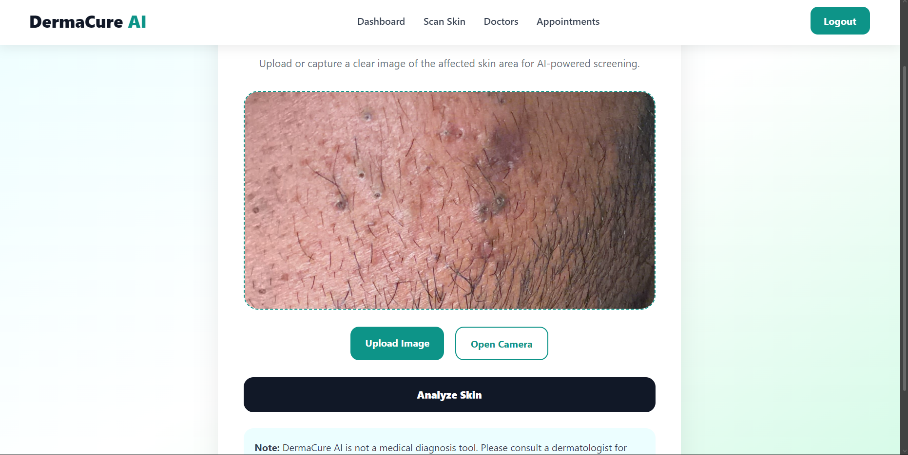
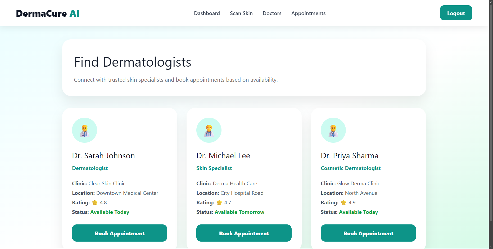
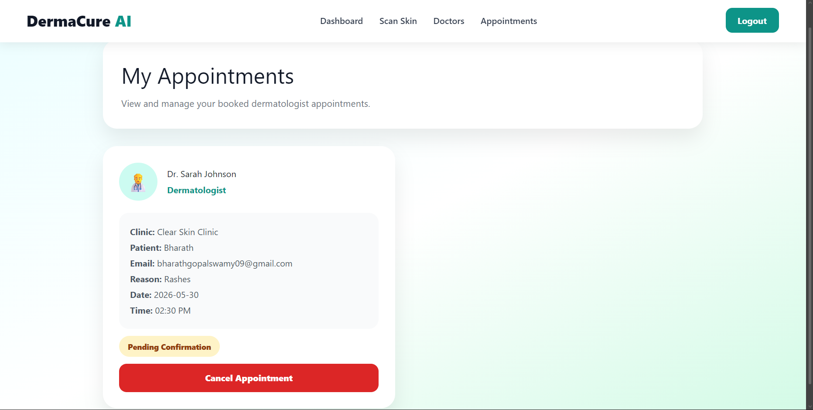

# DermaCure AI

DermaCure AI is a full-stack AI-powered skin screening and dermatologist appointment booking web application developed using the MERN Stack and TensorFlow.js.

The goal of this project is to help users perform a basic AI-powered skin analysis by uploading a skin image and receiving a possible skin condition prediction along with severity analysis, AI suggestions, and dermatologist recommendations.

This project combines frontend development, backend API development, authentication, image uploads, MongoDB integration, and AI model integration into a single real-world healthcare application.

---

# Technologies Used

## Frontend

* React.js
* Vite
* React Router DOM
* Axios
* CSS
* TensorFlow.js
* Teachable Machine

## Backend

* Node.js
* Express.js
* MongoDB Atlas
* Mongoose
* JWT Authentication
* bcryptjs
* Multer

---

# Features

## Authentication System

The application includes a complete authentication system with user registration and login functionality. Users can create accounts as patients or doctors, and passwords are securely encrypted using bcrypt. JWT authentication is used to manage login sessions securely.

---

## AI Skin Analysis

Users can upload or capture skin images directly from their device. The uploaded image is analyzed using a TensorFlow.js model trained with Google Teachable Machine.

The AI analysis provides:

* Predicted skin condition
* AI confidence percentage
* Severity level
* Suggested skincare recommendations
* Recommended products
* Dermatologist recommendation

---

## Dermatologist Appointment Booking

Users can browse dermatologist profiles and dynamically book appointments based on doctor availability.

The system supports:

* Viewing dermatologist profiles
* Dynamic booking forms
* Appointment management
* Appointment cancellation
* MongoDB appointment storage

---

## Dashboard

The dashboard provides:

* Skin health overview
* Scan statistics
* Recent activities
* Appointment summary
* Quick actions

---

# Project Structure

```bash
derma_ai/
│
├── public/
│   └── model/
│
├── screenshots/
│
├── server/
│   ├── models/
│   ├── routes/
│   ├── uploads/
│   ├── .env
│   └── server.js
│
├── src/
│   ├── api/
│   ├── components/
│   ├── data/
│   ├── pages/
│   ├── stylesheets/
│   └── App.jsx
│
├── package.json
└── README.md
```

---

# Installation Guide

## Clone the Repository

```bash
git clone https://github.com/bharathgopalswamy/DermaAI
cd DermaAI
```

---

# Frontend Setup

Install frontend dependencies:

```bash
npm install
```

Install TensorFlow.js packages:

```bash
npm install @tensorflow/tfjs @teachablemachine/image
```

Run the frontend:

```bash
npm run dev
```

Frontend runs on:

```bash
http://localhost:5173
```

---

# Backend Setup

Move into the server directory:

```bash
cd server
```

Install backend dependencies:

```bash
npm install
```

Run the backend server:

```bash
npm run dev
```

Backend runs on:

```bash
http://localhost:5000
```

---

# Environment Variables

Create a `.env` file inside the `server` folder and add:

```env
PORT=5000
MONGO_URI=your_mongodb_connection_string
JWT_SECRET=your_secret_key
```

---

# TensorFlow.js Model Setup

This project uses a TensorFlow.js image classification model exported from Google Teachable Machine.

## Steps

1. Create a Teachable Machine Image Project
2. Train classes such as:

   * Acne
   * Rash
   * Eczema
   * Dark Spots
   * Normal Skin
3. Export the model as TensorFlow.js
4. Place the exported files inside:

```bash
public/model/
```

Required files:

```bash
model.json
metadata.json
weights.bin
```

The model is loaded directly in the React frontend using TensorFlow.js and performs image analysis inside the browser.

---

# API Routes

## Authentication Routes

```http
POST /api/auth/register
POST /api/auth/login
```

## Appointment Routes

```http
POST /api/appointments
GET /api/appointments
DELETE /api/appointments/:id
```

## Scan Routes

```http
POST /api/scans/upload
GET /api/scans
```

---

# Application Screenshots

## Dashboard


The dashboard provides quick access to AI scan statistics, health scores, appointments, and recent activity.

---

## Scan Skin Page



Users can upload or capture skin images directly from their device and run AI-powered analysis.

---

## AI Scan Result Page


The scan result page displays the predicted skin condition, confidence percentage, severity analysis, AI suggestions, and recommended products.

---

## Dermatologists Page



Users can browse dermatologist profiles and dynamically book appointments based on doctor availability.

---

## My Appointments Page



Booked appointments are stored in MongoDB and displayed dynamically for the user.

---

# Current Progress

The following modules have been completed successfully:

* MERN Stack setup
* MongoDB Atlas integration
* Authentication system
* JWT login system
* Dynamic appointment booking
* Doctor pages
* TensorFlow.js AI integration
* Image upload backend
* AI scan result page
* MongoDB scan storage
* Responsive UI design
* Dashboard system

---

# Future Improvements

Future enhancements planned for the project include:

* Improved AI model accuracy
* Doctor dashboard
* Scan history analytics
* Real-time notifications
* Email verification
* Video consultation support
* Cloud image storage
* Deployment on Vercel and Render
* Advanced medical AI integration

---

# Disclaimer

DermaCure AI is developed for educational and project purposes only. The AI-generated results are not medical diagnoses and should not be considered professional healthcare advice. Users are encouraged to consult certified dermatologists for accurate diagnosis and treatment.

---

# Author

Bharath Gopalsamy
