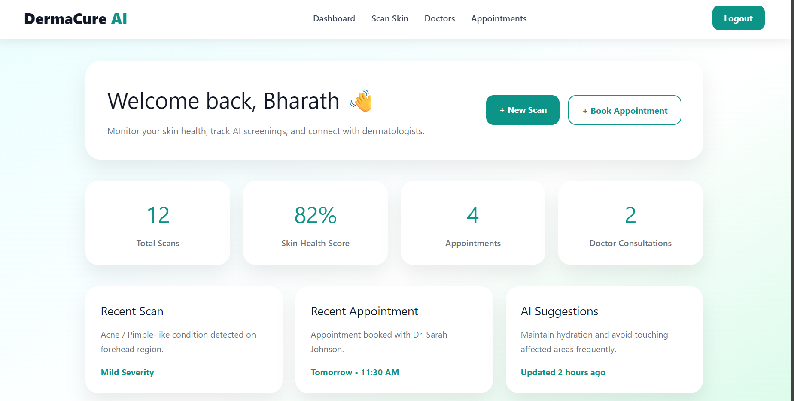
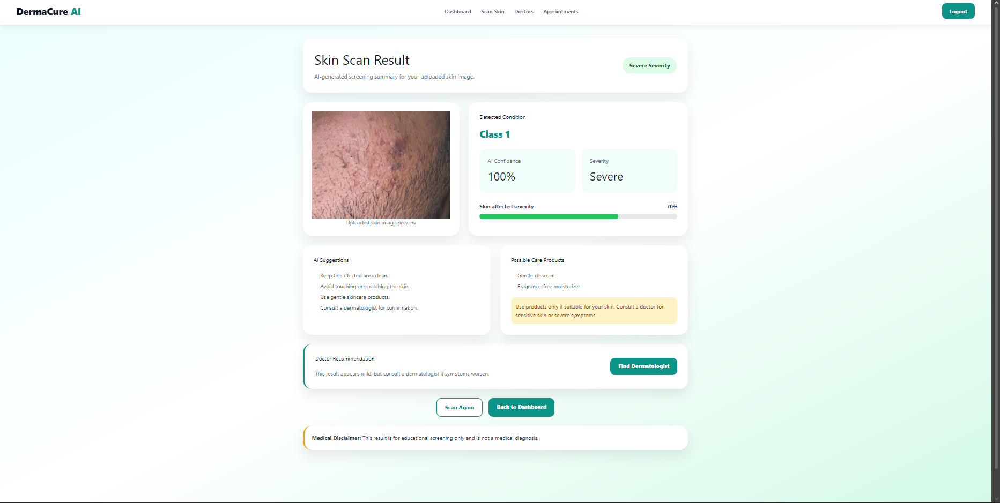

# DermaCure AI

DermaCure AI is a full-stack AI-powered skin screening and dermatologist appointment booking application developed using the MERN stack and TensorFlow.js. The goal of this project is to help users perform an initial AI-based skin analysis by uploading a skin image and receiving a possible prediction along with suggestions and dermatologist recommendations.

I built this project to combine AI integration with modern full-stack web development concepts such as authentication, image uploads, API development, MongoDB integration, and frontend AI inference using TensorFlow.js.

The application allows users to register and login securely, upload skin images, analyze them using an AI model trained with Teachable Machine, view scan results, and book dermatologist appointments dynamically.

---

# Tech Stack

The frontend of the application is built using React.js and Vite. React Router DOM is used for navigation between pages, while Axios is used for API communication between the frontend and backend.

The backend is built with Node.js and Express.js. MongoDB Atlas is used as the cloud database, and Mongoose is used for database modeling and queries.

For authentication, JWT and bcryptjs are used to securely manage user login and password encryption.

The AI integration is implemented using TensorFlow.js along with a Teachable Machine image classification model.

---

# Features

The application currently includes:

* User registration and login system
* Role-based authentication
* JWT authentication
* AI skin image analysis
* Upload image and camera capture support
* TensorFlow.js AI integration
* Dynamic scan result page
* Dermatologist listing page
* Appointment booking system
* Appointment cancellation
* MongoDB database integration
* Image upload backend using Multer
* Dashboard with recent activity and quick actions
* Responsive UI design

---

# Project Structure

```bash
derma_ai/
│
├── public/
│   └── model/
│
├── screenshots/
│
├── server/
│   ├── models/
│   ├── routes/
│   ├── uploads/
│   └── server.js
│
├── src/
│   ├── api/
│   ├── components/
│   ├── data/
│   ├── pages/
│   ├── stylesheets/
│   └── App.jsx
│
└── README.md
```

---

# Installation

To run this project locally, first clone the repository:

```bash
git clone https://github.com/yourusername/dermacure-ai.git
cd dermacure-ai
```

Install frontend dependencies:

```bash
npm install
```

Install TensorFlow.js packages:

```bash
npm install @tensorflow/tfjs @teachablemachine/image
```

Run the frontend:

```bash
npm run dev
```

The frontend will run on:

```bash
http://localhost:5173
```

---

# Backend Setup

Move into the server folder:

```bash
cd server
```

Install backend dependencies:

```bash
npm install
```

Run the backend server:

```bash
npm run dev
```

The backend will run on:

```bash
http://localhost:5000
```

---

# Environment Variables

Create a `.env` file inside the `server` folder and add:

```env
PORT=5000
MONGO_URI=your_mongodb_connection_string
JWT_SECRET=your_secret_key
```

---

# TensorFlow Model Setup

This project uses a TensorFlow.js image classification model exported from Google Teachable Machine.

After training the model, the exported files should be placed inside:

```bash
public/model/
```

The required files are:

```bash
model.json
metadata.json
weights.bin
```

The AI model is loaded directly in the frontend using TensorFlow.js and performs skin condition prediction locally in the browser.

---

# Application Screenshots

## Dashboard



The dashboard provides quick access to AI scans, appointment tracking, recent activities, and health insights.

---

## Skin Scan Page


Users can upload or capture skin images and run AI-powered skin analysis directly from the browser.

---

## AI Scan Result



The result page displays the detected skin condition, AI confidence score, severity level, suggestions, and recommended products.

---

## Dermatologist Booking


Users can browse dermatologist profiles and dynamically book appointments based on doctor availability.

---

## My Appointments


Booked appointments are stored in MongoDB and displayed dynamically in the appointments page.

---

# Current Progress

So far, the application includes a fully functional frontend and backend integration with authentication, appointment booking, MongoDB storage, AI image analysis, and TensorFlow.js model integration.

The project is still being improved with plans to add more advanced AI models, doctor dashboards, analytics, cloud image storage, and deployment support.

---

# Disclaimer

DermaCure AI is developed for educational and project purposes only. The AI-generated results are not medical diagnoses and should not be considered professional healthcare advice. Users are encouraged to consult certified dermatologists for accurate diagnosis and treatment.

---

# Author

Bharath Gopalsamy
